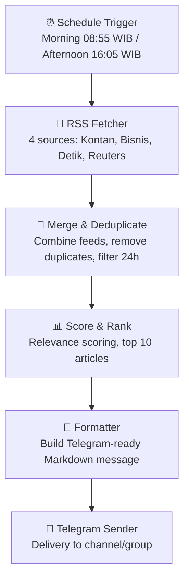

# System Architecture

## Overview

IDN-StockNews is an automated market briefing pipeline built on n8n. It collects Indonesian and global stock news from RSS feeds and APIs, processes and summarizes them, then delivers structured briefings via Telegram.

## High-Level Flow



## Pipeline Architecture (n8n Workflow)

```
Manual Trigger / Schedule Trigger (08:55 + 16:05 WIB)
    ├→ Fetch Kontan (RSS)  ──→ Merge Group A ──┐
    ├→ Fetch Bisnis (RSS)  ──→      ↑          │
    ├→ Fetch Detik  (RSS)  ──→ Merge Group B ──┤→ Merge All
    └→ Fetch Reuters (RSS) ──→      ↑          │
                                               ↓
                              Deduplicate & Filter (24h)
                                               ↓
                              Score & Rank (top 10)
                                               ↓
                              Format Telegram Message
                                               ↓
                              Send to Telegram 📲
```

## Components

| Component | Technology | Purpose |
|-----------|------------|---------|
| Workflow Engine | n8n (self-hosted) | Orchestrate all automation |
| News Sources | RSS Read (4 feeds) | Fetch raw articles from Kontan, Bisnis, Detik, Reuters |
| Processing | n8n Code nodes (JS) | Deduplicate, filter, score, rank, format |
| Delivery | Telegram Bot API | Send briefings to channel/group |
| Database | PostgreSQL 16 | n8n execution history + future analytics |
| Infra | Docker Compose + nginx | Container runtime + reverse proxy |

## RSS Sources

| Source | URL | Category | Language |
|--------|-----|----------|----------|
| Kontan - Pasar Modal | `investasi.kontan.co.id/rss/...` | market | ID |
| Bisnis.com - Pasar Modal | `market.bisnis.com/rss` | market | ID |
| Detik Finance | `finance.detik.com/rss` | economy | ID |
| Reuters - Indonesia | `feeds.reuters.com/reuters/...` | global | EN |

## Design Principles

- **Stateless workflows** — each run is independent; no persistent state between runs
- **Fail-safe delivery** — errors in one source don't block others (`onError: continueRegularOutput`)
- **Modular** — each node handles one responsibility
- **Local-first** — runs on a VPS or local Docker without external dependencies
- **Scheduled** — automatic Morning (08:55 WIB) and Afternoon (16:05 WIB) editions
